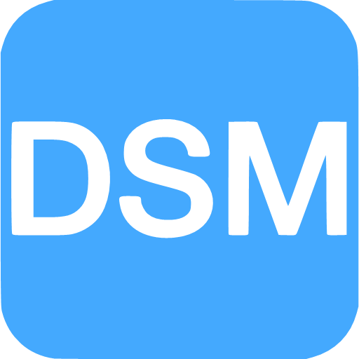
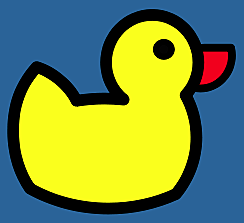
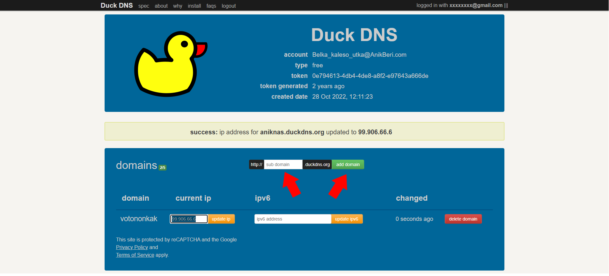
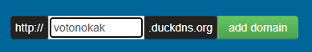
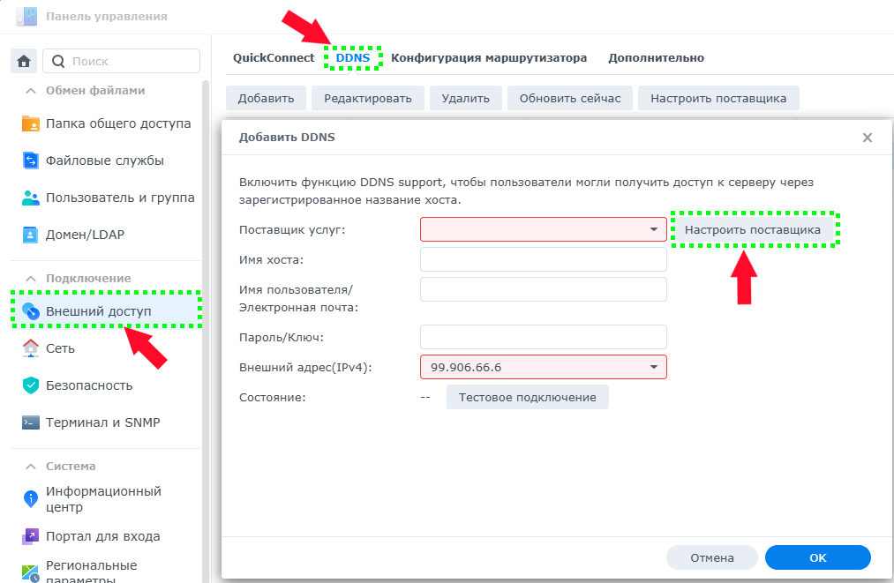
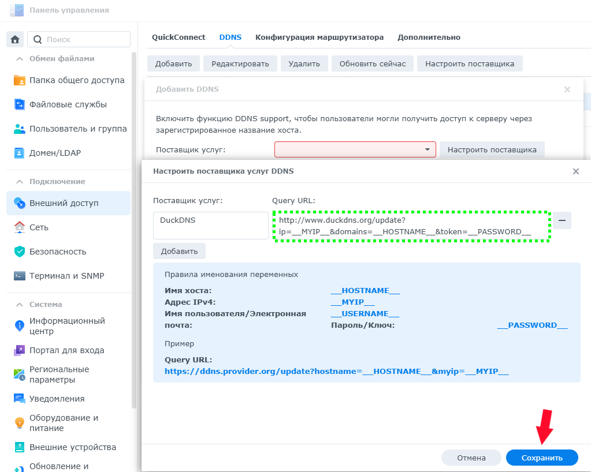
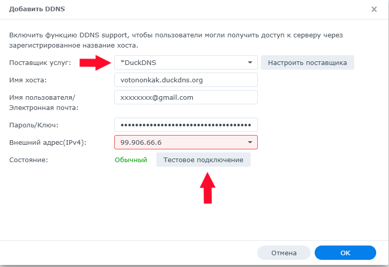
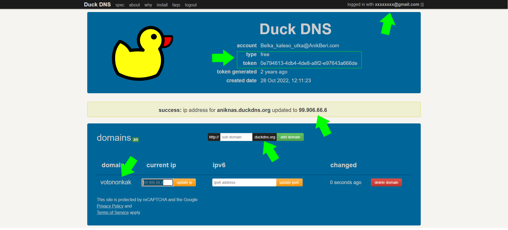
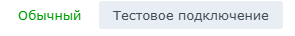

**------->** [English](/README_en_EN.md) | [Русский](/README.md) **<-------**

<p align="center">
  <picture>
    <source media="(prefers-color-scheme: dark)" srcset="./media/logo-dark.png">
    
  </picture>
</p>

---

<div align="center">

[](https://github.com/AnikBeris)
[](https://github.com/AnikBeris/n8n-docker/blob/main/LICENSE.md)
[](https://github.com/AnikBeris)

</div>

# Техническое руководство по добывлению [DuckDNS](https://www.duckdns.org) в DSM [Synology](https://www.synology.com/).


> **Отказ от ответственности:** Всё преведенные материалы расчитаны на личное использование.

**Если этот проект оказался полезным для Вас, вы можете оценить его, поставив звёздочку.**:star2:

<p align="left">
  <a href="https://pay.cloudtips.ru/p/7249ba98" target="_blank">
    
  </a>
</p>

Пожертвования горячо приветствуются, какими бы маленькими они ни были, и большое спасибо. 😌

| | |
|-------------:|:-------------|
| **Bitcoin (BTC)** |`1Dbwq9EP8YpF3SrLgag2EQwGASMSGLADbh`|
| **Ethereum (ERC20)** | `0x22258ea591966e830199d27dea7c542f31ed5dc5`|
| **Binance Smart Chain (BEP20)** | `0x22258ea591966e830199d27dea7c542f31ed5dc5`|
| **Solana (SOL)** | `yYYXsiVTzsvfvsMnBxfxSZEWTGytjAViE2ojf3hbLeF`|
| **Cloud tips** | [cloudtips](https://pay.cloudtips.ru/p/7249ba98) |
---

<table align="center">
  <tr>
    <td></td>
    <td></td>
  </tr>
</table>


# 🚀 Установка [DuckDNS](https://www.duckdns.org)


Этот гайд поможет вам добавить поставщика услуг в виде **DuckDNS** в оболочку **DSM** версии **DSM 7..** и выше

---

# Шаг 1: 📌 Создание домена
---


- вводим доменное `имя` и нажимаем `add a domain`


---

# Шаг 2: 📌 переходим в [Synology](https://www.synology.com/) и создаём поставщика услуг



- `панель управления -> Внешний доступ -> DDNS -> Кнопка ДОБАВИТЬ -> Настроить поставщика`

---



- заполяем поле `Query URL:`:

```bash
http://www.duckdns.org/update?
ip=__MYIP__&domains=__HOSTNAME__&token=__PASSWORD__

```

---

# Шаг 3: 📌 Заполняем поля:



- для заполнения берём информацияю с сайта [DuckDNS](https://www.duckdns.org)



- - **`выбираем созданного поставщека услуг`** в *моём случае это `DuckDNS`*
- - **`имя хоста`** это `cсозданный суб домен + домен (.duckdns.org)` в *моём случае `votonokak.duckdns.org`*
- - **`имя пользователя`** это `почта` на которую зарегестрирован акаунт в *моём случае `xxxxxxxx@gmail.com`*
- - **`пароль/ключь`** это `token`
- - **`внешний адрес (IPv4)`** выбираем либо:
- - - **`АВТО`** `->` будет подставлен внешний IP адрес для доступа из сети интернет
- - - **`ЛВС1`** `->` будет подставлен IP адрес первого порта Lan (физичесни подключеного)
- - - **`ЛВС2`** `->` будет подставлен IP адрес второго порта Lan (физичесни подключеного)

# -> **нажимаем тестовое подключение** <-
если всё сделано правильно загорится зелёный текст 
---

---
