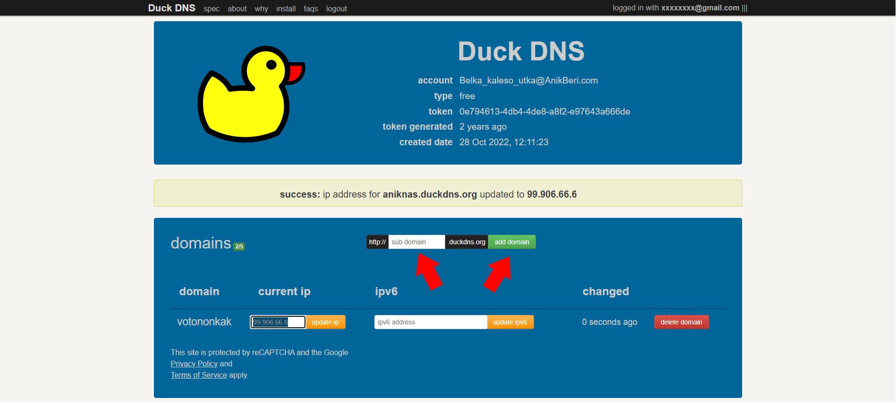
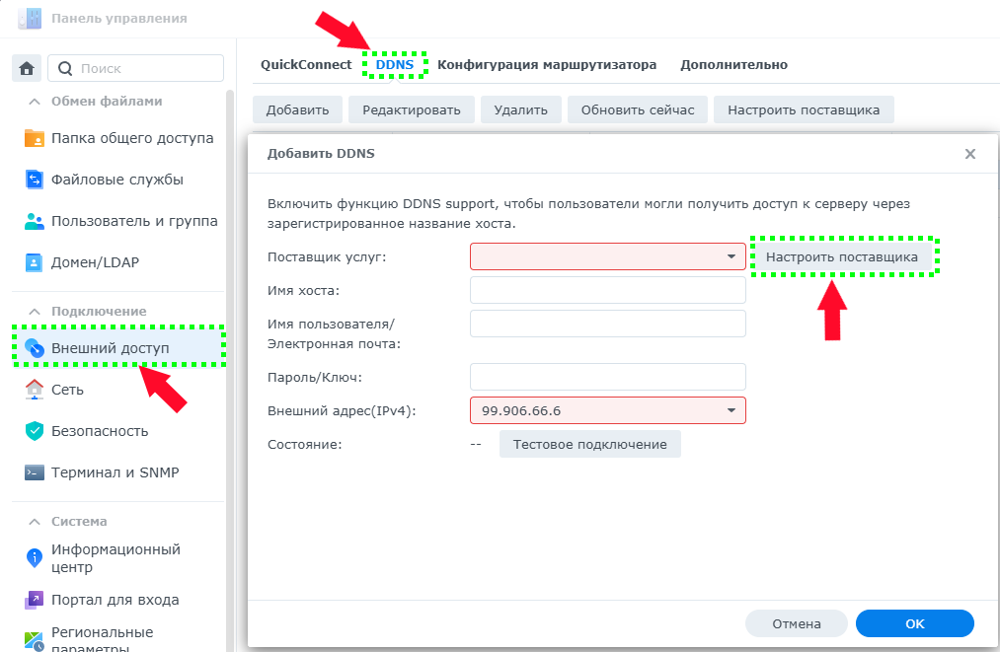

**------->** [English](/README_en_EN.md) | [Русский](/README.md) **<-------**

<p align="center">
  <picture>
    <source media="(prefers-color-scheme: dark)" srcset="./media/logo-dark.png">
    
  </picture>
</p>

---

<div align="center">

[](https://github.com/AnikBeris)  
[](https://github.com/AnikBeris/n8n-docker/blob/main/LICENSE.md)  
[](https://github.com/AnikBeris)

</div>

# Technical Guide for Adding [DuckDNS](https://www.duckdns.org) to DSM [Synology](https://www.synology.com/)

> **Disclaimer:** All provided materials are intended for personal use.

**If this project was helpful to you, consider starring it.** :star2:

<p align="left">
  <a href="https://pay.cloudtips.ru/p/7249ba98" target="_blank">
    
  </a>
</p>

Donations are greatly appreciated, no matter how small. Thank you very much. 😌

| | |
|-------------:|:-------------|
| **Bitcoin (BTC)** | `1Dbwq9EP8YpF3SrLgag2EQwGASMSGLADbh` |
| **Ethereum (ERC20)** | `0x22258ea591966e830199d27dea7c542f31ed5dc5` |
| **Binance Smart Chain (BEP20)** | `0x22258ea591966e830199d27dea7c542f31ed5dc5` |
| **Solana (SOL)** | `yYYXsiVTzsvfvsMnBxfxSZEWTGytjAViE2ojf3hbLeF` |
| **Cloud tips** | [cloudtips](https://pay.cloudtips.ru/p/7249ba98) |

---
  <picture>
    
    
  </picture>

# 🚀 Installing [DuckDNS](https://www.duckdns.org)

This guide will help you add a service provider such as **DuckDNS** into the **DSM** shell version **DSM 7..** and above.

---

# Step 1: 📌 Create a Domain
---


- Enter the domain `name` and click `add a domain`


---

# Step 2: 📌 Go to [Synology](https://www.synology.com/) and Create a Service Provider



- `Control Panel -> External Access -> DDNS -> ADD button -> Customize Provider`

---


- Fill in the `Query URL:` field:

```bash
http://www.duckdns.org/update?
ip=__MYIP__&domains=__HOSTNAME__&token=__PASSWORD__
```

---

# Step 3: 📌 Fill in the Fields


- Use information from the [DuckDNS](https://www.duckdns.org) website to fill out the form.


- **`Select the created service provider`** – in *my case, it's `DuckDNS`*  
- **`Hostname`** – the subdomain + domain (`.duckdns.org`), e.g., *`votonokak.duckdns.org`*  
- **`Username`** – the email address registered on DuckDNS, e.g., *`xxxxxxxx@gmail.com`*  
- **`Password/Key`** – this is your `token`  
- **`External Address (IPv4)`** – choose one of the following:  
  - **`AUTO`** – uses your current external IP address  
  - **`LAN1`** – uses the IP of the first LAN port (physically connected)  
  - **`LAN2`** – uses the IP of the second LAN port (physically connected)

# -> **Click "Test Connection"** <-

If everything is correct, a green message will appear:  


---